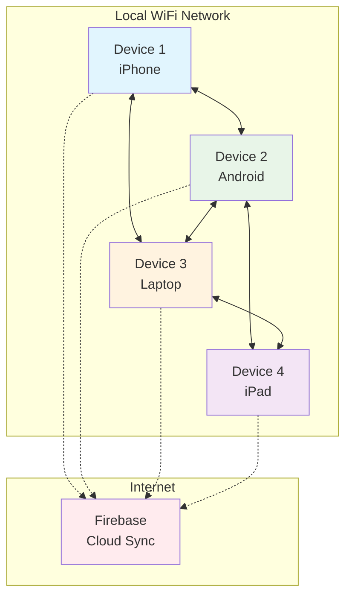
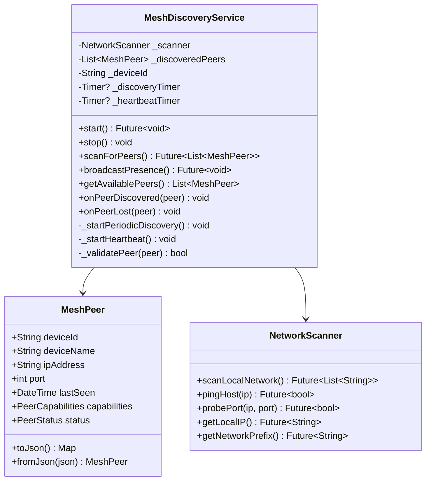
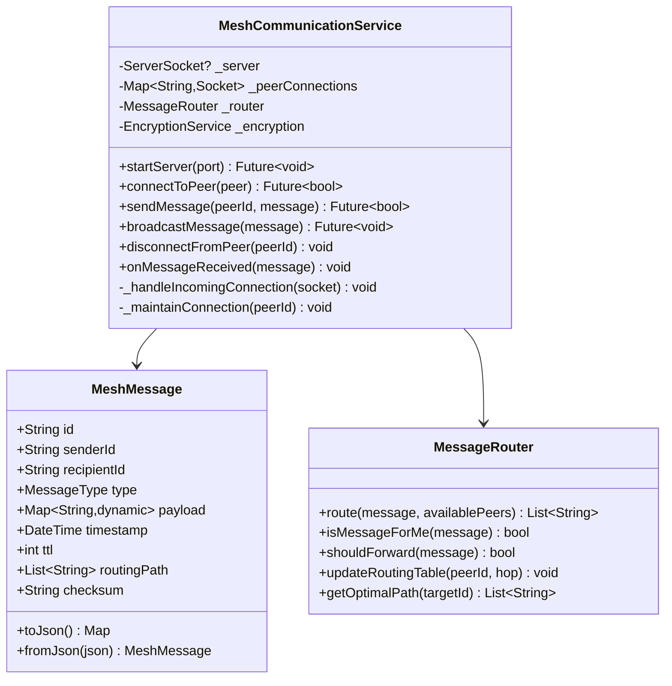
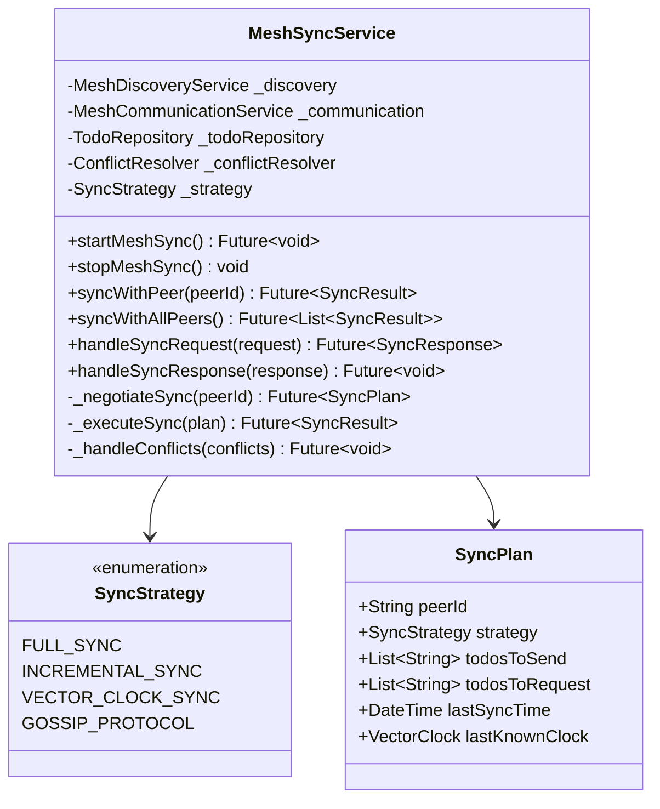
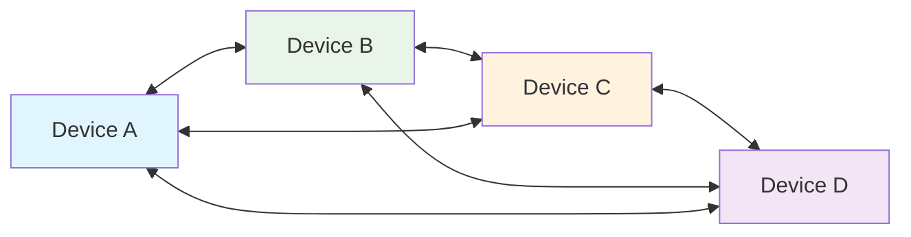
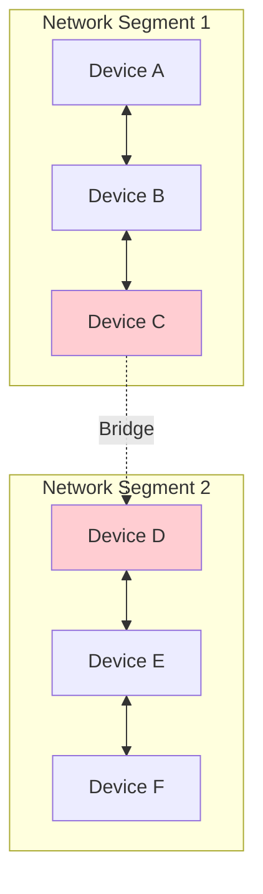
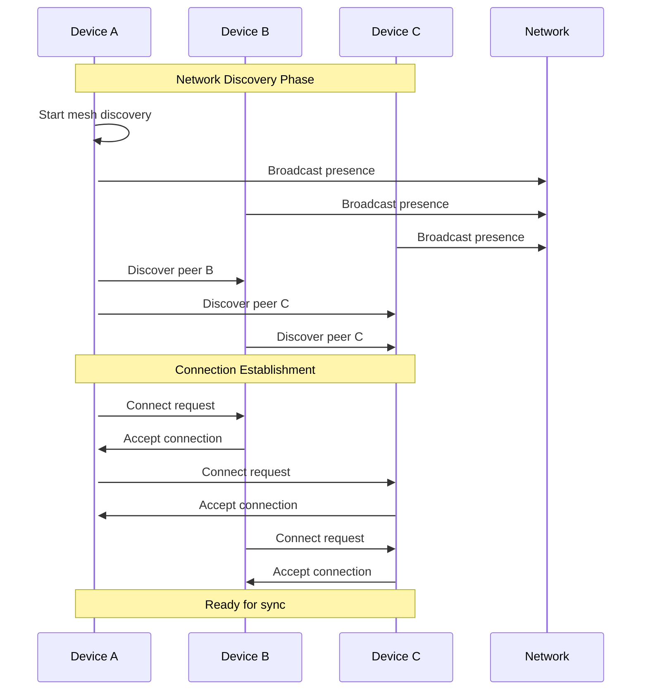
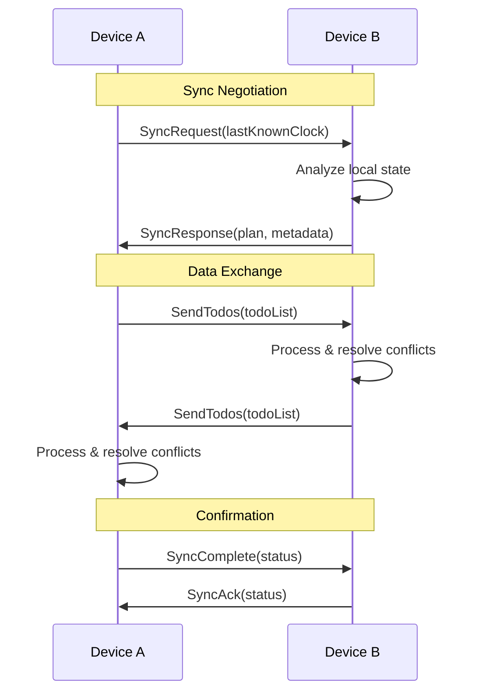
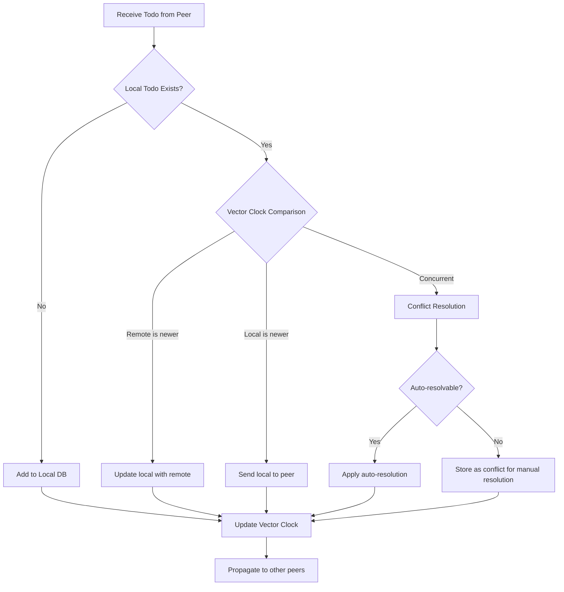
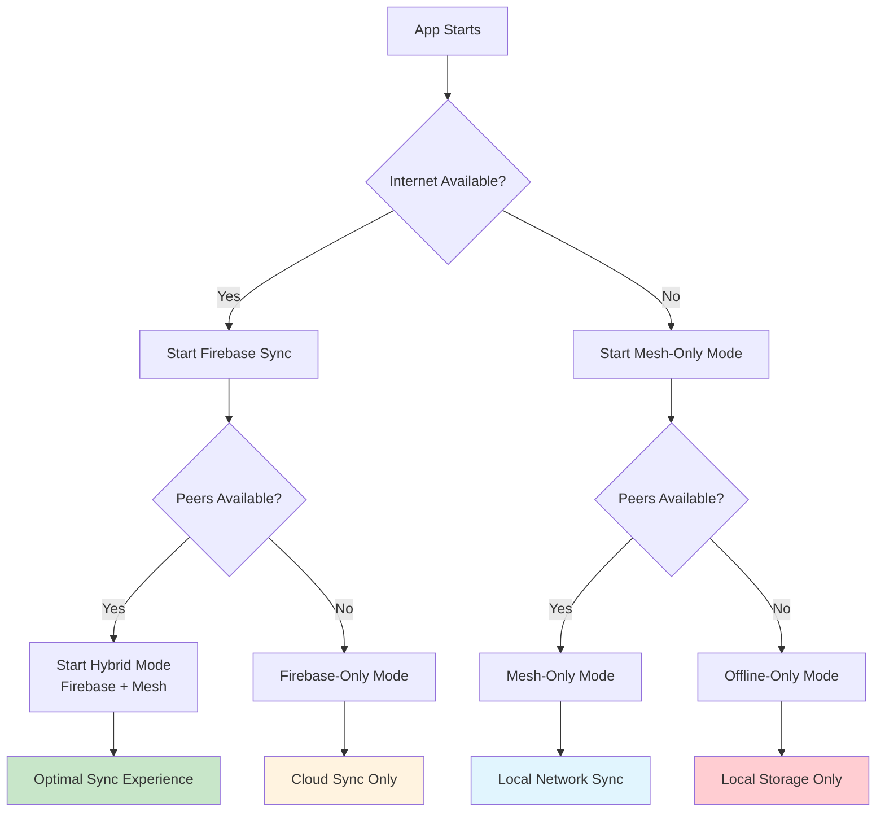

# Mesh Networking Architecture for Distributed Todo App

## Overview

This document outlines the mesh networking architecture that extends the existing offline-first todo application to enable peer-to-peer synchronization when devices are on the same WiFi/WLAN network, without requiring internet connectivity.

## Table of Contents

1. [Mesh Networking Concepts](#mesh-networking-concepts)
2. [Architecture Overview](#architecture-overview)
3. [Core Components](#core-components)
4. [Network Topology](#network-topology)
5. [Data Synchronization Flow](#data-synchronization-flow)
6. [Implementation Plan](#implementation-plan)
7. [Integration with Existing System](#integration-with-existing-system)

## Mesh Networking Concepts

### What is Mesh Networking?
Mesh networking creates a decentralized network where devices communicate directly with each other without requiring a central server. In our context, devices on the same WiFi network can discover each other and synchronize todo data peer-to-peer.

### Key Benefits
- **Offline Operation**: Works without internet connectivity
- **Resilience**: No single point of failure
- **Low Latency**: Direct device-to-device communication
- **Scalability**: Automatically adapts to network changes
- **Privacy**: Data stays within local network

## Architecture Overview



## Core Components

### 1. Mesh Discovery Service

Handles device discovery and network topology management.



### 2. Mesh Communication Layer

Handles peer-to-peer communication and message routing.



### 3. Mesh Sync Service

Orchestrates data synchronization across the mesh network.



## Network Topology

### 1. Flat Mesh Network
All devices are equal peers that can communicate directly.



### 2. Bridge Network (for larger deployments)
Some devices act as bridges to extend network reach.



## Data Synchronization Flow

### 1. Discovery and Connection Flow



### 2. Sync Negotiation Flow



### 3. Conflict Resolution in Mesh



## Implementation Plan

### Phase 1: Core Infrastructure (Week 1-2)

1. **Network Discovery**
   - Implement mDNS/Bonjour service discovery
   - Local network scanning functionality
   - Peer capabilities negotiation

2. **Basic Communication**
   - TCP socket server/client implementation
   - Message serialization/deserialization
   - Basic error handling and retries

### Phase 2: Sync Mechanism (Week 3-4)

1. **Extend Existing Sync Service**
   - Add mesh sync capabilities to existing `SyncService`
   - Implement peer-to-peer sync protocols
   - Integrate with existing vector clock system

2. **Conflict Resolution Enhancement**
   - Adapt existing `ConflictResolver` for mesh scenarios
   - Handle multi-peer conflicts
   - Implement gossip protocol for conflict propagation

### Phase 3: Advanced Features (Week 5-6)

1. **Topology Management**
   - Dynamic peer discovery
   - Connection health monitoring
   - Automatic reconnection

2. **Performance Optimization**
   - Incremental sync based on vector clocks
   - Data compression for large payloads
   - Connection pooling and reuse

### Phase 4: Integration & Testing (Week 7-8)

1. **UI Integration**
   - Mesh status indicators
   - Peer visibility in app
   - Manual sync triggers

2. **Comprehensive Testing**
   - Multi-device testing scenarios
   - Network failure simulation
   - Performance benchmarking

## Integration with Existing System

### 1. Enhanced Sync Service

```dart
class EnhancedSyncService extends SyncService {
  final MeshSyncService _meshSync;
  
  @override
  Future<void> start() async {
    await super.start(); // Start Firebase sync
    await _meshSync.startMeshSync(); // Start mesh sync
  }
  
  @override
  Future<SyncResult> forceSync() async {
    final results = await Future.wait([
      super.forceSync(), // Firebase sync
      _meshSync.syncWithAllPeers(), // Mesh sync
    ]);
    
    return SyncResult.combined(results);
  }
}
```

### 2. Extended Todo Entity

The existing `Todo` entity already has everything needed for mesh networking:
- Device ID tracking
- Vector clocks for causality
- Conflict resolution metadata
- Version management

### 3. Hybrid Sync Strategy



## Security Considerations

### 1. Network Security
- **Device Authentication**: Use device certificates or shared secrets
- **Message Encryption**: Encrypt all peer-to-peer communications
- **Network Isolation**: Only sync with trusted devices

### 2. Data Integrity
- **Message Signing**: Sign all sync messages with device keys
- **Checksums**: Verify data integrity during transmission
- **Version Validation**: Ensure vector clock consistency

### 3. Privacy Protection
- **Local Network Only**: Never expose data beyond local network
- **Opt-in Sharing**: Require explicit user consent for mesh participation
- **Data Minimization**: Only share necessary synchronization data

## Required Dependencies

Add these to `pubspec.yaml`:

```yaml
dependencies:
  # Networking
  network_info_plus: ^4.1.0  # Network interface discovery
  nsd: ^2.0.0               # Network service discovery (mDNS)
  
  # Security
  crypto: ^3.0.3            # Cryptographic functions
  pointycastle: ^3.7.3      # Advanced cryptography
  
  # Utilities
  uuid: ^4.1.0              # UUID generation
  collection: ^1.17.2       # Advanced collections
```

## Performance Considerations

### 1. Bandwidth Optimization
- **Delta Sync**: Only send changes since last sync
- **Compression**: Use gzip for large payloads
- **Batching**: Group multiple operations

### 2. Memory Management
- **Connection Pooling**: Reuse TCP connections
- **Message Queuing**: Buffer messages during network issues
- **Cache Management**: Smart caching of peer data

### 3. Battery Optimization
- **Adaptive Discovery**: Reduce scanning frequency when stable
- **Background Limits**: Minimize background network activity
- **Connection Reuse**: Avoid frequent connection establishment

This architecture provides a robust foundation for mesh networking while leveraging your existing sophisticated conflict resolution and vector clock systems. The implementation can be done incrementally, starting with basic peer discovery and building up to full mesh synchronization capabilities. 